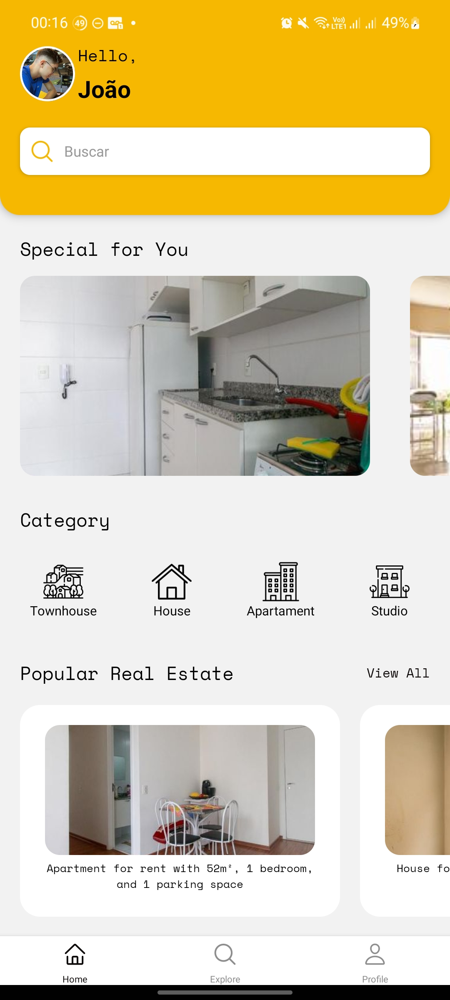
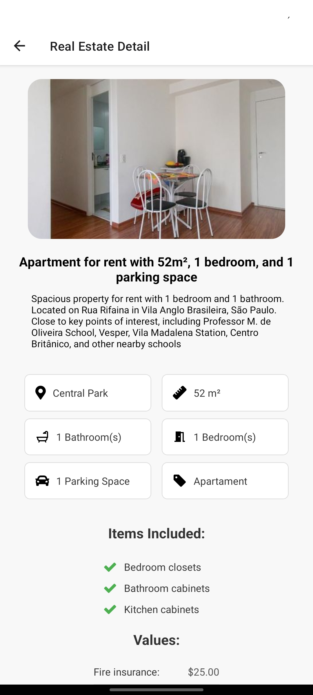
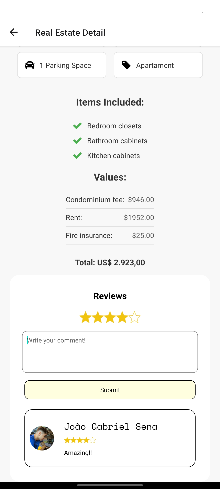
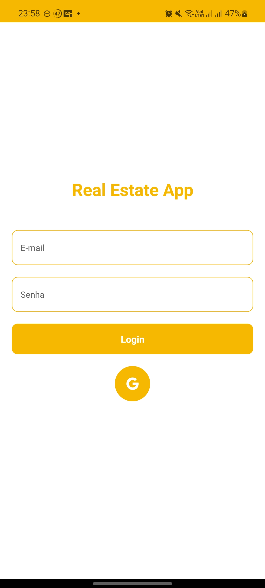
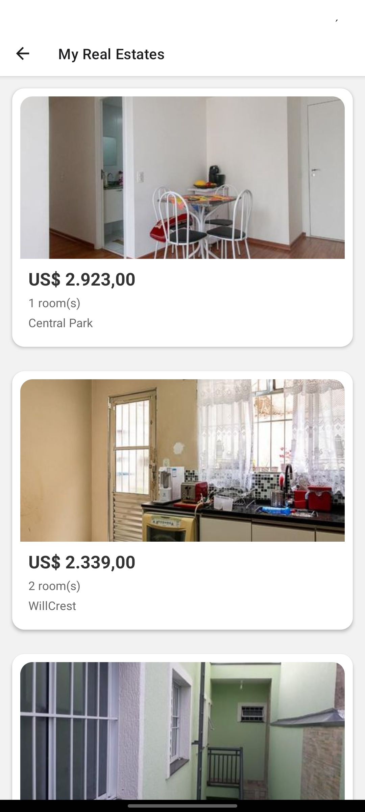
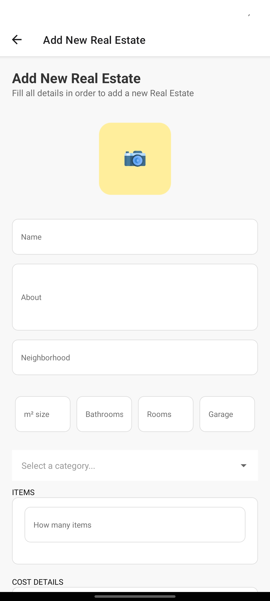

# 🏡 Real Estate App

A brief description of what this project does and who it's for.

This app is a cutting-edge, user-friendly platform designed to streamline the management and viewing of real estate properties. It caters to real estate companies, agents, and individuals seeking a fast and efficient way to rent or purchase properties. Leveraging Firebase Firestore and Firebase Storage, the app ensures real-time data synchronization, secure storage, and seamless handling of property listings and user data.

## 🚀 Features

- 🏠 Home Screen with Cards and categories filter

- 📋 Display a list of properties with advanced filters by neighborhood, property type, and number of rooms.

- 📱 Detailed view of properties, including images, location, items included, cost details, and full descriptions.
- ⭐ Review and rating star system
- 🎠 Image carousel to browse property photos.

- 👤 Secure login using Clerk, with support for multiple authentication methods, including OAuth with Google.

- 🔒 Profile Screen with the Real Estates of the actual user and an add new real estate option

